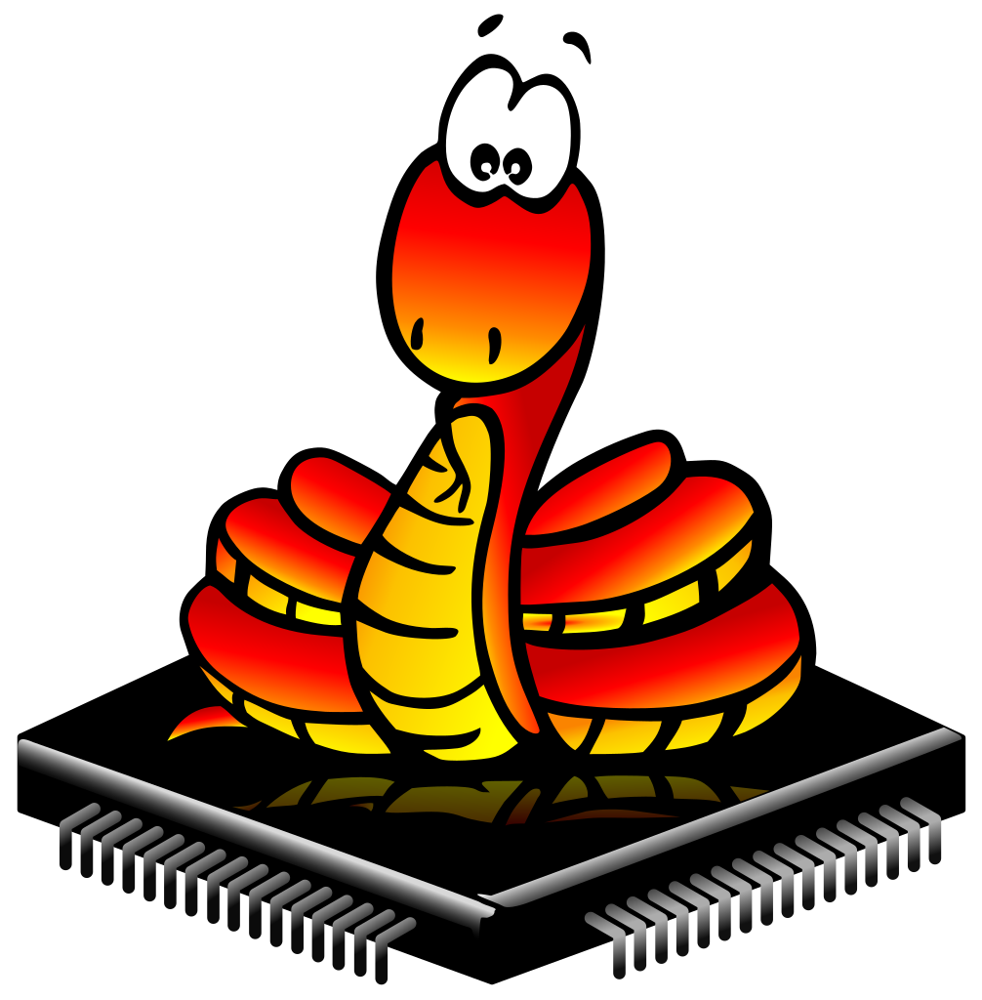
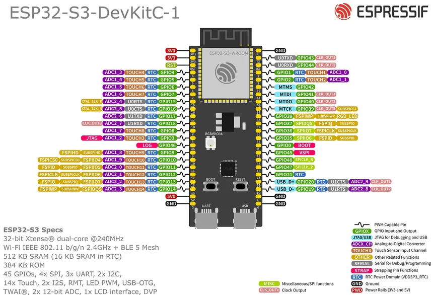

# LOGO

Profesor: Gonzalo Vera

Alumno: Fernando Gimenez Coria
### **Presentacion de la estructura de monorepositorio**
# TP#2: Fundamentos de Programación IoT y Módulos de Desarrollo Objetivos

## **Resumen de repositorio actual TP#2**
**Objetivos**
- Entender y aplicar los fundamentos de la programación en Arduino y MicroPython en el contexto de IoT, enfocándose en el manejo de entradas y salidas digitales y analógicas.

- Desarrollar habilidades prácticas en el uso de módulos de desarrollo y shields para ESP32, explorando diversas aplicaciones de los módulos en proyectos IoT.

- Implementar controladores básicos utilizando ESP32, que gestionen efectivamente entradas y salidas tanto digitales como analógicas.

- Familiarizarse con las herramientas de desarrollo como PlatformIO y RT-Thread en Visual Studio Code y utilizar la simulación en Wokwi para validar los programas desarrollados.

# Organizacion de la estructura del repositorio

1-requisitos: aqui se encuentran los requisitos propios del TP

2-investigacion: aqui se guarda toda la documemtacion recolectada para el desarrollo del TP

3-prototipos: Aqui se guardan los archivos propios de cada prototipo requerido por el TP

4-presentacion: Aqui se almacena el informe final del practico

## **Resumen del desarrollo**

El trabajo practico propone la investigacion de plataformas para programar controladores basicos para el manejo de entradas y salidas.

Ademas, continuamos la practica y mejora de conocimientos anteriores como el manejo de Git y GitHub.

Por ultimo dispara el aprendizaje y aplicacion de nuevas extensiones para VsCode como Platformio y micropython.