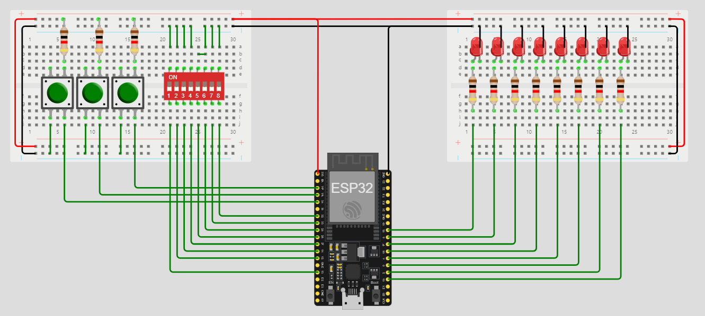

# LOGO

Profesor: Gonzalo Vera

Alumno: Fernando Gimenez Coria
# **Presentacion de la estructura de monorepositorio**

## TP#1: Introduccion al IoT

## TP#2: Fundamentos de Programación IoT y Módulos de Desarrollo Objetivos

## TP#3: Transductores binarios

# **Resumen de repositorio actual TP#3**

**Objetivos**

- Practicas con el framework de Arduino en VsCode

- Primera aproximación a un entrenador básico

- Practica con sensores y actuadores digitales

- Primera aproximación a un controlador

# Desarrollo

Los ejercicios seran simulados en el siguiente simulador propuesto por el docente

# Organizacion de la estructura del repositorio

1-requisitos: aqui se encuentran los requisitos propios del TP

2-investigacion: aqui se guarda toda la documemtacion recolectada para el desarrollo del TP

3-prototipos: Aqui se guardan  arpeta por carpeta los 16 ejercicios propuestos en los requisitos

4-presentacion: Aqui se almacena el informe final del practico

## **Resumen del desarrollo**

El trabajo practico propone profundizar la investigacion del IDE Platformio para programar controladores basicos para el manejo de entradas y salidas.

Ademas, continuamos la practica y mejora de conocimientos anteriores como el manejo de Git y GitHub.

Por ultimo dispara el aprendizaje y aplicacion de librerias, interrupciones, comunicaciones basicas.