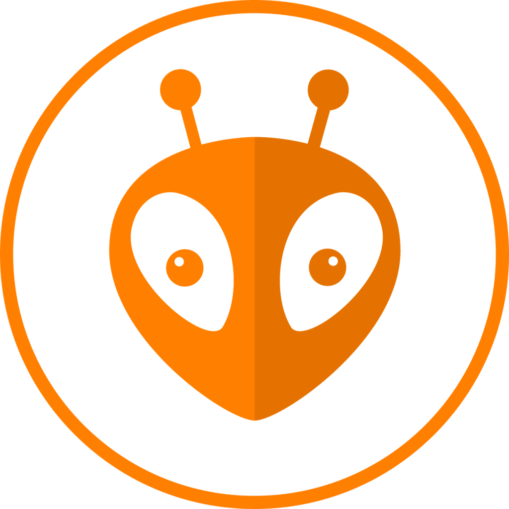

# LOGO

Profesor: Gonzalo Vera

Alumno: Fernando Gimenez Coria
# **Presentacion de la estructura de monorepositorio**

## TP#1: Introduccion al IoT

## TP#2: Fundamentos de Programación IoT y Módulos de Desarrollo Objetivos

## TP#3: Transductores binarios

## Actualmente trabajando en 
## TP#4: Manejo de entradas, salidas y sensores

# **Resumen de repositorio actual TP#4**

**Objetivos**

• Afianzar fundamentos de programación en C/C++

• Afianzar fundamentos de herramientas de desarrollo ( simuladores, ide)

• Afianzar fundamentos de sensores y actuadores básicos.

# Desarrollo

Los ejercicios seran diseñados y simulados en Proteus a pedido del docente

# Organizacion de la estructura del repositorio

1-requisitos: aqui se encuentran los requisitos propios del TP

2-investigacion: aqui se guarda toda la documemtacion recolectada para el desarrollo del TP

3-prototipos: Aqui se guardan  carpeta por carpeta los 3 ejercicios propuestos en los requisitos

4-presentacion: Aqui se almacena el informe final del practico

## **Resumen del desarrollo**

El trabajo practico propone dearrollar el manejo del simulador Proteus, que permite documentar el circuito esquematico, el codigo fuente y el diseño de PCB si fuera necesario (no corresponde al alcance de este curso).

Ademas, continuamos la practica y mejora de conocimientos anteriores como el manejo de Git y GitHub, programacion C/C++ en entorno arduino.

# **Perfil del Alumno**

